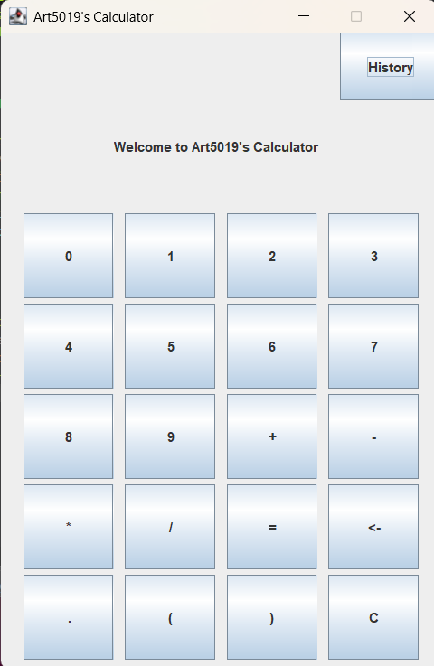

# BODMAS Java Calculator

One thing that always bothered me is that most "calculators" that are shown as exercise or even as first projects, can't really calculate anything besides the basic four operations, two integer numbers at time, so I decided to do as my first actual Java project, build an calculator that can do more than one operation at a time using BODMAS, etc...

## Functionalities:
* Visual GUI that is pretty easily updatable since it doesn't rely on Windowbuilder.
* More than one operation at time, using BODMAS rule to decide which one will be performed.
* Use of Brackets to determine Sub-Accounts, which can handle other Sub-Accounts with brackets, which are manipulated and calculated using Recursion.
* The user can use Floating Point numbers.
* Delete and Clear Button.
* history.txt File that saves every account solved, their result and Time that it was done, can easily be accessed by pressing the History button.
* The Calculator easily handles Irrational Numbers as results of Accounts.

